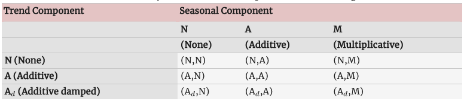

```{r, child="00-preamble.Rmd"}

```

class: middle, center

---

```{r, include = FALSE}

library(tidyverse)

cetesb_pinheiros <- readRDS("../dados/cetesb_pinheiros.rds")

```


# Séries temporais

- Uma série temporal pode ser entendida como uma lista de números associadas a marcos de tempo.

- Do ponto de vista estritamente prático não há diferença entre:

.pull-left[

Duas variáveis: `tempo` e `x`

```{r, echo = FALSE}
  knitr::kable(
    tibble::tribble(
      ~tempo, ~x,
      1, 0.1,
      5, 0.18,
      3, 0.19,
      2, 0.22,
      4, 0.23
    )
  )
```
]

.pull-right[

uma variável `x` ordenada no tempo

```{r, echo = FALSE}
  knitr::kable(
    tibble::tribble(
      ~tempo, ~x,
      1, 0.1,
      2, 0.22,
      3, 0.19,
      4, 0.23,
      5, 0.18
    )
  )
```

]


- Na hora de analisar esses dados, entretanto, pensar que `x` está ordenado no tempo, e não que `tempo` é uma variável, dá **contexto** para as análises e provavelmente vai produzir resultados diferentes.

---

# Séries temporais no R

- Essa diferença entre os jeitos de interpretar uma série temporal resulta entre representações diferentes dentro do R também.

- `tibble` é o tipo de objeto padrão do `tidyverse`. Para interpretar uma `tibble` sempre como uma série temporal em qualquer contexto, vamos usar um pacote que se chama `tsibble`.

- Vamos ao R

---

# Porque séries temporais são especiais

- O tempo nunca para de passar: então pra qualquer variável $X_1, X_2, ..., X_n$ é verdade que elas estão ordenadas no tempo de algum jeito. 

- Vamos querer pensar que uma lista de números é uma série temporal porque **normalmente** tem uma diferença importante com relação a dados em que podemos ignorar a relação com o tempo. Nesse curso o contrário de "série temporal" será **dado transversal**.

- Na maior parte das aplicações e análises **transversais** aceitamos as hipóteses:

$$X_1 \text{ não tem relação com }X_2\text{, nem com }X_3\text{, nem com }X_4\text{ etc}$$
$$X_2 \text{ não tem relação com }X_1\text{, nem com }X_3\text{, nem com }X_4\text{ etc}$$
- Nas séries temporais essa é exatamente a hipótese que nós jogamos fora. Nesse tipo de análise vamos sempre pensar que os dados da série temporal tem algum tipo de relação importante que precisamos dar atenção na hora de analisar.

---

# Relações entre variáveis

- O conceito estatístico de dependência é muito importante aqui. Duas variáveis $X$ e $Y$ **não tem relação** se, quando fizermos um gráfico de $X$ contra $Y$ encontramos uma nuvem em que $Y$ sempre se distribui mais ou menos do mesmo jeito se fizermos cortes em $X$.

```{r, echo = FALSE, fig.height=6}

set.seed(11071995)

tibble(
  X = runif(1000),
  Y = runif(1000)) |> 
  ggplot(aes(x = X, y = Y)) + 
  geom_point() + 
  theme_bw() +
  geom_vline(xintercept = 0.125, col = 'red', size = 2) +
  geom_vline(xintercept = 0.25, col = 'red', size = 2) +
  geom_vline(xintercept = 0.625, col = 'darkgreen', size = 2) +
  geom_vline(xintercept = 0.75, col = 'darkgreen', size = 2)
```

---

# Relações entre variáveis

- Outro exemplo de variáveis não relacionadas:

```{r, echo = FALSE}

set.seed(11071995)

tibble(
  X = runif(5000, -2, 2),
  Y = rnorm(5000)) |> 
  ggplot(aes(x = X, y = Y)) + 
  geom_point() + 
  theme_bw() +
  geom_vline(xintercept = -1.8, col = 'red', size = 2) +
  geom_vline(xintercept = -1, col = 'red', size = 2) +
  geom_vline(xintercept = 1, col = 'darkgreen', size = 2) +
  geom_vline(xintercept = 1.8, col = 'darkgreen', size = 2)

```

---

# Relações entre variáveis

- Exemplo de variáveis relacionadas:

```{r, echo = FALSE}
set.seed(11071995)

tibble(
  X = runif(5000, -2, 2),
  Y = X + rnorm(5000, 0, .5)) |> 
  ggplot(aes(x = X, y = Y)) + 
  geom_point() + 
  theme_bw() +
  geom_vline(xintercept = -1.8, col = 'red', size = 2) +
  geom_vline(xintercept = -1, col = 'red', size = 2) +
  geom_vline(xintercept = 1, col = 'darkgreen', size = 2) +
  geom_vline(xintercept = 1.8, col = 'darkgreen', size = 2)
```

---

# Variáveis relacionadas e séries temporais

- No geral, quando manipulamos uma série temporal $X_t$ e construímos gráficos, por exemplo, de $X_{t-1}$ contra $X_t$, vamos identificar que existe relação entre essas variáveis.

- Chamamos os $X_{t-i}$ de **variáveis defasadas** ou **lags**. 

- Vamos ao R

---

# Relações entre variáveis

- Cuidado com a correlação linear, os gráficos são bons!

```{r, echo = FALSE, message=FALSE, error=FALSE, warning=FALSE}
anscombe_tidy <- anscombe %>%
    mutate(observation = seq_len(n())) %>%
    gather(key, value, -observation) %>%
    separate(key, c("variable", "set"), 1, convert = TRUE) %>%
    mutate(set = c("I", "II", "III", "IV")[set]) %>%
    spread(variable, value)

ggplot(anscombe_tidy, aes(x, y)) +
    geom_point(size = 3) +
    facet_wrap(~ set) +
    geom_smooth(method = "lm", se = FALSE, size =2) +
    theme_bw()
```

---

# Padrões comuns em séries temporais

Normalmente, tanto para previsão quanto para descrever vamos tentar enquadrar as séries temporais de acordo com alguns padrões:

- **Sazonalidade**: Periodicamente acontece alguma coisa com a série temporal? Padrões semanais, mensais etc?

- **Tendência**: Tem algo sistematicamente acontecendo nos dados? Por exemplo, a quantidade aumenta a cada ano?


---

# Entendendo a série temporal

Pensar nos componentes da série (tendência/sazonalidade) ajudam bastante a pensar
em como melhorar as previsões.

```{r, echo=FALSE, message=FALSE, warning=FALSE, out.width="100%", fig.dim=c(8, 5), fig.retina=2}
library(fable)
library(feasts)
soja <- readRDS("../dados/soja.rds")
soja_ts <- soja %>% 
  mutate(DATA = tsibble::yearmonth(paste(CO_ANO, CO_MES))) %>% 
  as_tsibble(index = DATA)

soja_ts %>% 
  model(
    STL(
      KG_LIQUIDO ~ trend() + season()
    )) |>
  components() %>% 
  autoplot()
```

---

# Médias móveis

Médias móveis é uma forma comum de estimar a tendência de uma série temporal,
retirando variações perródicas que podem não importar.

Ex: Nas notícias sobre COVID é reportado a média móvel dos últimos 7 dias ao invés
do valor exato.

```{r, echo=FALSE, fig.retina=2, fig.dim=c(8,4), out.width="100%"}
soja_ts %>% 
  mutate(
    MM = slider::slide_dbl(KG_LIQUIDO, .before = 6, .after = 6, mean, complete=TRUE)
  ) %>% 
  autoplot(KG_LIQUIDO) +
  geom_line(aes(y = MM), color = "red")
```

---

# Decomposição clássica

1. Fazemos a média móvel para estimar a tendência. (chamamos de $\hat{T}$).
2. Fazemos o valor da série menos a tendência. Agora calculamos a sazonalidade
fazendo a média dos valores para cada período.
3. Calculamos o resto.

```{r echo=FALSE, fig.retina=2, fig.dim=c(8,4), out.width="100%", warning=FALSE}
soja_ts %>%
  model(
    classical_decomposition(KG_LIQUIDO, type = "additive")
  ) %>%
  components() %>%
  autoplot()
```

---

# Decomposição STL

Um jeito de analisar séries temporais, inclusive de produzir previsões é aplicar o que se chama normalmente de decomposição STL, que tenta ajustar funções muito flexíveis na equação abaixo:

$$X(t) = S(t) + T(t) + E(t).$$

Aqui teremos $S(t)$ sendo um componente sazonal periódica, $T(t)$ é algo que aumenta ao longo do tempo.

Vantagens com relação aos outros métodos:

- Sazonalidade pode mudar ao longo do tempo
- Funciona com sazonalidades mais complexas (eg, nao precisa ser mensal, anual, etc.)

---
class: middle, center

[Vamos ao R!](https://github.com/curso-r/main-series/blob/main/scripts/02-decomposicao.R)

---

# Forecasting

Criar previsões sobre fenômenos é uma tarefa muito difícil e para algumas coisas
até impossível. Antes de fazer um modelo, é sempre importante pensar em algumas
coisas:

- O que faz o que está sendo medido se modificar?
- Temos dados disponíveis?
- Quanto o passado é parecido com o futuro?
- O quanto prever pode influenciar o futuro?

> Often in forecasting, a key step is knowing when something can be forecast accurately, and when forecasts will be no better than tossing a coin.

---

# Workflow

Criar previsões é um processo que cíclico. Isto é, vamos aprendendo sobre a base
de dados conforme visualizamos os resultados dos modelos.


---

# Formular o problema de predição

- Definir o 'horizonte' de previsão. Quanto tempo para frente eu preciso prever?
- Definir a granularidade da previsão? Quero prever diariamente? Mensalmente? 
- Quais informações adicionais são relevantes para a previsão? 
Sempre terei essas informações?

---

# Tidy 

Em geral são:

- Transformações de escala: para muitos modelos normalizar as variáveis ajuda na estimação por exemplo.
- Inputação de missing: Às vezes a base possui dados faltantes. Existem técnicas para imputar esses valores de forma que façam sentido para séries.
- Correção de outliers: Às vezes uma observação é um missing mas, ela é um valor muito diferente da série. Pode ser um erro de medida, ou pode ter sido causada por um evento muito raro. (dependendo do caso pode fazer sentido corrigir.)

---

# Backtesting

Se a quantidade de dados não é limitante essa é a melhor forma de validar e 
criar confiança nos modelos que construimos.

```{r, warning=FALSE, message=FALSE, echo=FALSE, fig.dim=c(8,5), fig.retina=2, out.width="100%"}
library(tidyverse)
library(timetk)

co <- readRDS("../dados/cetesb_pinheiros_diario_co.rds")
resample_spec <- time_series_cv(
  data = co,
  initial     = "2 years",
  assess      = "2 months",
  skip        = "2 months",
  cumulative  = FALSE,
  slice_limit = 1
)

plot_time_series_cv_plan(resample_spec, data, concentracao, .interactive=FALSE)
```

---

# Backtesting

É possível inclusive, fazer vários períodos de backtesting para ter mais segurança. 

```{r, warning=FALSE, message=FALSE, echo=FALSE, fig.dim=c(8,5), fig.retina=2, out.width="100%"}
library(tidyverse)
library(timetk)

co <- readRDS("../dados/cetesb_pinheiros_diario_co.rds")

resample_spec <- time_series_cv(data = co,
                                initial     = "2 years",
                                assess      = "2 months",
                                skip        = "2 months",
                                cumulative  = FALSE,
                                slice_limit = 3)
resample_spec %>%
    plot_time_series_cv_plan(data, concentracao, .interactive = FALSE)
```

---

# Backtesting

- Ajuda a estimar o erro de previsão de uma forma mais segura do que somente a análise de resíduos.
- É o equivalente à validação cruzada para séries temporais.
- Ajuda a evitar overfitting.

- É importante escolher o período de teste de forma que fique parecido com o que pretendemos prever. Ex: não adianta testar o modelo em 2 meses se quando for usá-lo estivermos pegando previsão para 4 meses.
- Note que em séries temporais, mesmo com backtesting é mais fácil de ter overfitting do que em problemas clássicos de ML. Principalmente quando não entendemos os fatores que influenciam a série.

---

# Métricas

As principais métricas são:

- MAE - Mean absolute error: **não** comparável entre séries.
- RMSE - Root mean squared error: **não** comparável entre séries.
- RSQ - R-squared: correlação ao quadrado entre predito e observado.

- MAPE - Mean absolute percentage error: comparável entre séries, porém assimétrica (prever a mais ou a menos tem valores diferentes)
- SMAPE - Symmetric mean absolute percentage error: tenta corrigir a assimetria do MAPE mas, não funciona muito bem.

- MASE - Mean absolute scaled error: Mais complicado de calcular. Pode ser comparada entre séries e é simétrica.

Pensar na métrica é sempre importante! Dependo do problema você pode querer modificá-la. Por exemplo:

Previsão de demanda: prever abaixo tem um custo 'x', prever acima tem outro custo 'y', qual é maior?

---

# Modelo inicial

Antes de começarmos a usar modelos mais complexos é comum utilizarmos os modelos mais básicos possíveis. 

- Teremos uma visão do quanto a série é 'previsível'.
- Podemos avaliar se o esforço de fazer um modelo mais complexo tem retorno.
- Criamos mais conhecimento do que estamos tentando prever.

Dois algoritmos simples:

1. Média móvel: pegamos a média dos últimos 'm' períodos e utilizamos como o valor predito.
2. Modelo ingênuo: a predição é uma repetição do último valor observado ou, se for sazonal do último período.

---

# Regressão Linear

Em alguns casos é possível utilizarmos modelos de regressão para fazer previsão
de séries temporais. 

$$y = \beta_0 + \beta_1x_1 + \beta_2x_2 + ...$$

Nesse caso, adicionamos variáveis preditoras (explicativas) que ajudam a controlar
o efeito temporal - includindo tendência e sazonalidade. Por exemplo:

- Categórias indicando mês, dia da semana, etc.
- Variáveis numéricas que indicam a tendência (tempo desde o início, etc)
- Outras flags que podem ajudar a explicar períodos atípicos, ou mudanças de tendência.
- Muito **cuidado** com variáveis que precisam ser conhecidas no período de previsão.

---

# Regressão (Revisão)

Variáveis categóricas em regressão são primeiro transformadas em um conjunto de
variáveis indicadoras. É possível pensar que a regressão de um valor por uma 
única variável categórica tem relação direta com calcular a média do $y$ para cada
nível de $x$.

Exemplo:

```{r}
y <- 1:8
x <- c("a", "a", "a", "b", "b", "b", "c", "c")

coef(summary(lm(y ~ x)))
tapply(y, x, mean)
```

---

# Interação na regressão

Podemos usar interação nos modelos de regressão quando temos a suposição de que
a inclinação da reta pode mudar dependendo do nível de alguma variável. 

```{r echo=FALSE, message=FALSE, warning=FALSE, out.width="100%", fig.retina=2, fig.dim=c(8,4)}
mtcars %>% 
  ggplot(aes(x = wt, y = mpg, color = as.factor(am))) +
  geom_point() +
  geom_smooth(se = FALSE, method = "lm")
```

---

# Suavização exponencial

É uma classe de modelos que em geral considera a suposição de que observações que
estão mais próximas tem maior peso na hora de calcular a próxima previsão e que 
esses pesos diminuem *exponencialmente* ao longo do tempo.

A ideia é dos anos 1950 e ao longo do tempo foi extendida para permitir incorporar
tendência, sazonalidade entre outros.

Em comparação com a regressão, o método faz suposições adicionais que permitem
reduzir o número de parâmetros e portanto, fazendo previsões mais robustas.

---

# Suavização exponencial simples

A forma mais simples de suavização exponencial não considera a existência de 
tendência nem sazonalidade. O modelo pode ser descrito, entre outros formatos,
na forma de componentes - que será útil quando estudarmos as extensões:

$$
\begin{align*}
  \text{Forecast equation}  && \hat{y}_{t+h|t} & = \ell_{t}\\
  \text{Smoothing equation} && \ell_{t}        & = \alpha y_{t} + (1 - \alpha)\ell_{t-1},
\end{align*}
$$

Se abrirmos essa fórmula para $h=1$ teríamos algo:

$$
\begin{equation}
  \hat{y}_{T+1|T} = \alpha y_T + \alpha(1-\alpha) y_{T-1} + \alpha(1-\alpha)^2 y_{T-2}+ \cdots
\end{equation}
$$
O problema fica resumido a estimar dois parâmetros: $\ell_0$ e $\alpha$.


---

# Holt

Extende a suavização expoencial simples adicionando a tendência:

$$
\begin{align*}
  \text{Forecast equation}&& \hat{y}_{t+h|t} &= \ell_{t} + hb_{t} \\
  \text{Level equation}   && \ell_{t} &= \alpha y_{t} + (1 - \alpha)(\ell_{t-1} + b_{t-1})\\
  \text{Trend equation}   && b_{t}    &= \beta^*(\ell_{t} - \ell_{t-1}) + (1 -\beta^*)b_{t-1},
\end{align*}
$$


Assim como o 'nível' -  $\ell_t$ - , a tendência é estimada como uma média móvel das
anteriores. 

Também podemos adicionar dampening:

$$
\begin{align*}
  \hat{y}_{t+h|t} &= \ell_{t} + (\phi+\phi^2 + \dots + \phi^{h})b_{t}
\end{align*}
$$

---

# Holt-Winters

Extende o método do Holt adicionando um componente de sazonalidade:

$$
\begin{align*}
  \hat{y}_{t+h|t} &= \ell_{t} + hb_{t} + s_{t+h-m(k+1)} \\
  \ell_{t} &= \alpha(y_{t} - s_{t-m}) + (1 - \alpha)(\ell_{t-1} + b_{t-1})\\
  b_{t} &= \beta^*(\ell_{t} - \ell_{t-1}) + (1 - \beta^*)b_{t-1}\\
  s_{t} &= \gamma (y_{t}-\ell_{t-1}-b_{t-1}) + (1-\gamma)s_{t-m},
\end{align*}
$$

Em alguns casos escrevemos a equação de forma multiplicativa:

$$
\begin{align*}
  \hat{y}_{t+h|t} &= (\ell_{t} + hb_{t})s_{t+h-m(k+1)} \\
  \ell_{t} &= \alpha \frac{y_{t}}{s_{t-m}} + (1 - \alpha)(\ell_{t-1} + b_{t-1})\\
  b_{t} &= \beta^*(\ell_{t}-\ell_{t-1}) + (1 - \beta^*)b_{t-1}                \\
  s_{t} &= \gamma \frac{y_{t}}{(\ell_{t-1} + b_{t-1})} + (1 - \gamma)s_{t-m}.
\end{align*}
$$

---

# ETS




